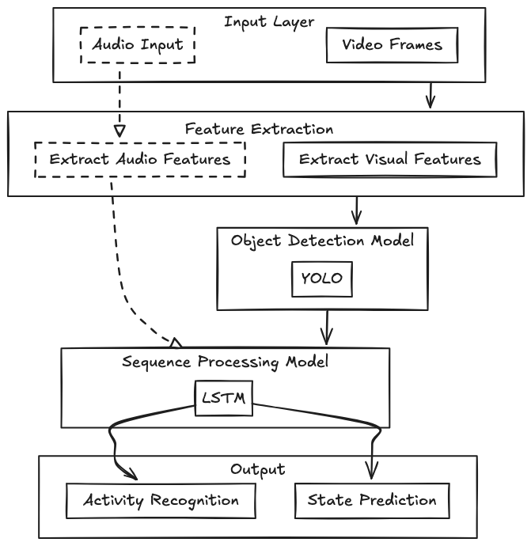

# Guess Teddys Next Move

This is a project to train a CV model on my brothers dog Teddy. Teddy is a wild boy and no one can guess his best move so I decided to put some ML models to the test!


## Table of Contents
- [Guess Teddys Next Move](#guess-teddys-next-move)
  - [Table of Contents](#table-of-contents)
  - [Usage](#usage)
  - [Setup](#setup)
  - [Folder Structure](#folder-structure)
  - [Data Collection](#data-collection)
  - [Diagram](#diagram)
  - [Insights](#insights)

## Usage
This repository really only provides two interesting components:
- [Data Collection](src/data_collection/) A data collection script that will take pictures from your blink cameras
- [YOLO + LSTM](src/app/) An example end to end application that will take a video and run the YOLO + LSTM model on it

Note: *The other scripts in this repository are intermediate steps used during development and model training. There are plenty better examples out there to probably train and inference models, but were necessary stepping stones to get to the end result.*

## Setup

- Setup your AWS credentials by creating a `.env` file with the following contents:
- Setup `.env` and `.terraform.tfvars` files using the example files
- Then run the following commands:
  
```bash
pip install -r requirements.txt
terraform init
terraform plan
terraform apply
```

## Folder Structure

```
.
├── data/
├── src/
    ├── cv/
    │   ├── models/                 # folder for storing models
    │   ├── train_set/              # folder for storing training data
    │   ├── inference.py            # cv model inference script
    │   ├── train.py                # cv model training script
    │   └── split_train_val_set.py
    │
    ├── ml/
    │   ├── models/             # folder for storing models
    │   ├── train_set/          # folder for storing training data
    │   ├── inference.py        # ml model inference script
    │   ├── train.py            # ml model training script
    │   └── convert.py          # script for converting cv output to ml format
    │
    ├── app/
    │   └── main.py             # main app script to run both models and optimizations on
    │
    └── data_collection/
        ├── main.py             # data collection script
        └── uploadToS3.py       # script to upload data to s3
```

## Data Collection

I have two blink cameras mini from amazon, theyre super cheap and I got a lightning deal for around $10 each. While these cameras have some technical limitations regarding video recording capabilities (without paying) and developer API access, theyre probably not the best for cv apps. But theyre good enough for this project.

First you need to download the app, set up any number of blink cameras. Add you username and password to the `.env` file. Then run the following command to start taking pictures each second for every camera:
```bash
python src/data_collection/main.py
```

To upload them to s3 create a folder `data/saved` and run 
```bash
python src/data_collection/uploadToS3.py
```


*You can easily seperate the buckets by changing the `data_collection_bucket_name` in you tfvars file rerunning the process.*

## Diagram



## Insights

Here are some things to think about when creating a project similar to this:

- **Background Class**: Initially, I considered adding a fifth state, such as teddy_drinking or teddy_eating. However, I realized there wasn't enough data for these classes. Instead, maintaining a still object still proved beneficial for the LSTM, as any movement would indicate camera shake (or movement), reducing the weight of the dx and dy parameters.
- **Skipping Inference**: By identifying when Teddy was in a "steady state" like teddy_lying, I chose to skip inferencing, which optimized performance.
- **Prioritizing States**: Assigning priorities to Teddy's states—teddy_howling > teddy_playing > teddy_lying > teddy (normal) assisted in addressing underfitting and resolving instances where Teddy was in multiple states simultaneously.

Some things I would do differently:

- **Audio**: Would help increase the accuracy of the model. It would also be fun to experiment with. For example I can use conditional computing to see if i get better performance.
- **Tiny Model Suite**: I'm interested to see how much better performance I can get by using a tiny YOLO model and how accurate it is.
- **Hardware Optimization**: Interested in seeing difference in inference speeds on a gpu versus a cpu. They handle different types of tasks differently.

For the rest of the writeup check it out on my portfolio here:
https://www.jathompson.dev/writing/power-of-multimodal-technique
